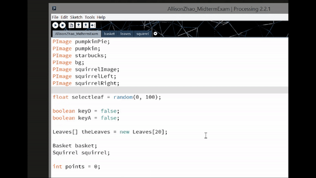

# Autumn Harvest Game  

This small game was written within 1.5 hours as a midterm exam for the Interactive Computing class at NYU (Fall 2015). All images and artwork were provided by the instructor before the exam. 

In order to run the programs on your local computer, please install [Processing 2 or higher versions](https://processing.org/).

## Demo

For those of you who do not have Processing installed (which is...90% of you?), here is a super quick demo:

Code:

Game Play:

P.S. All objects falling from the sky were randomly generated using [Perlin Noise](https://en.wikipedia.org/wiki/Perlin_noise), which is commonly used in game and visual media design. An interesting read here: http://flafla2.github.io/2014/08/09/perlinnoise.html.
