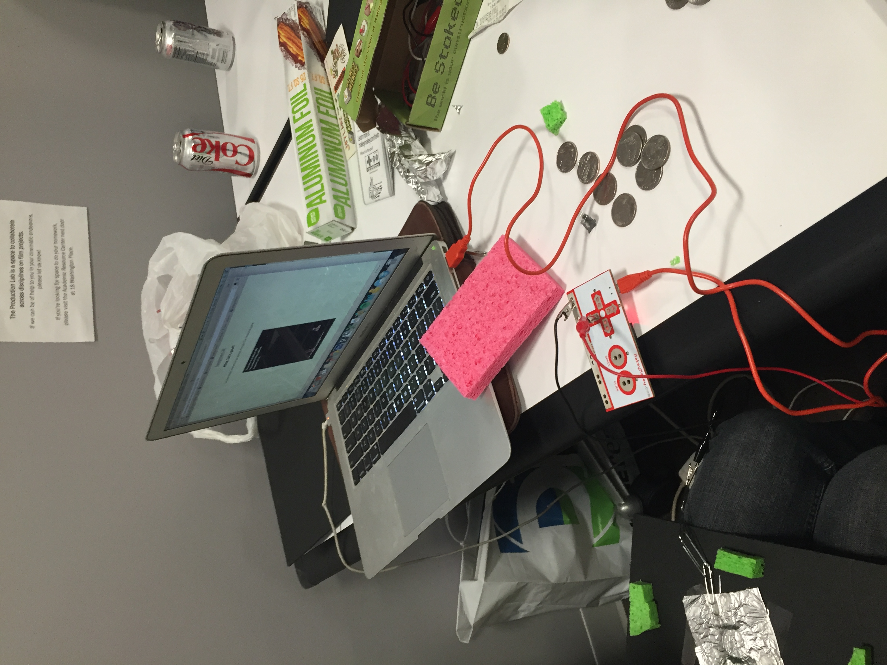
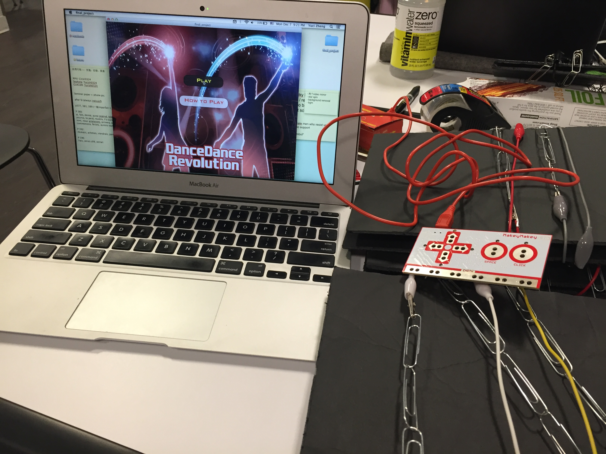

#Dance Dance Revolution remake 

As the final project for my Interactive Computing class at NYU (Fall 2015), 'DDR remake' was one of the most challenging programs my teammates and I have ever written. It incorporates motion detection from webcams (during the game, stars will fall from the top of the screen, and the players will need to put their hands up and wave at the webcam to make them disappear); we built the dance pad from scratch with [Makey Makey](http://makeymakey.com/about/), few sponges, cardboards and wires; my team and I were both about to graduate and we had very little time to code due to our busy schedules...

In short, many cans of Red Bull were consumed during the making, but the fun and friendship were irreplacable rewards of a lifetime. 

Due to copyright and licensing reasons, I am not able to upload the music and artwork in this program as they were downloaded from Google and were only used for educational purposes. Please check out a linked demo video below from my Google Drive (s/o to my teammates Yuci and Michael for demo-ing in the video)

(We used coins and aluminium foil as conductors)

#### PSA: As the project was built in a very short time, please refrain from poking fun at the slightly [corny](http://www.urbandictionary.com/define.php?term=corny) game design - it is the inner beauty of a program that matters...right...?) 

[Demo Video](https://drive.google.com/file/d/0ByGiBFdaFyMoZzZvc3VRVzFlUzA/view?usp=sharing)