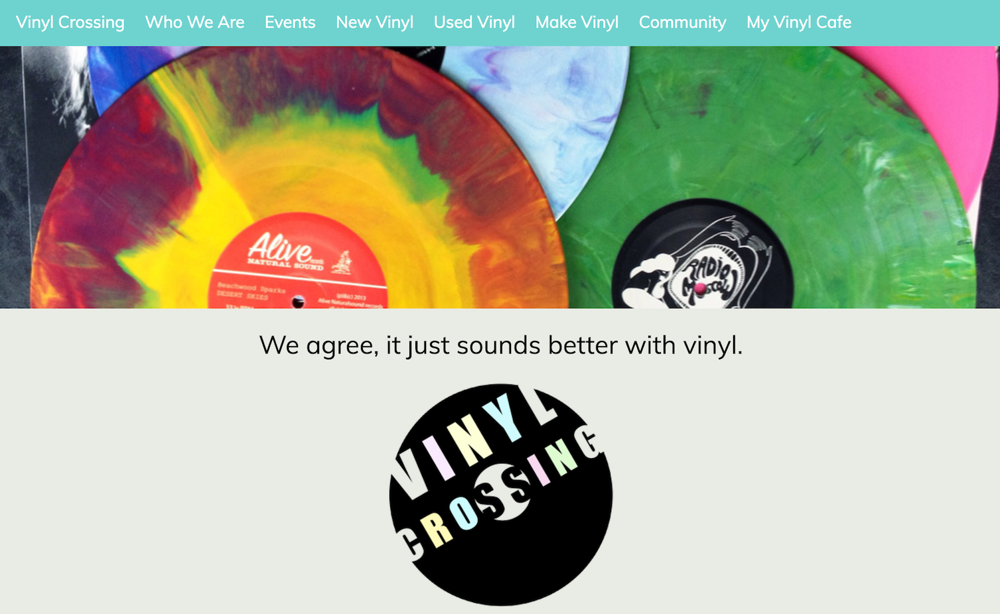

# Vinyl Crossing

During my 'Entrepreneurship In Music Industry' class in Spring 2016, my teammates and I came up with an idea for a start-up called 'Vinyl Crossing' - a web application that help people exchange vinyl, purchase new/second-hand vinyl, make customized vinyl records and party at vinyl events. I volunteered to build a [MVP](https://en.wikipedia.org/wiki/Minimum_viable_product) for the site and put together a rough outline of the site very quickly. 

The site is far from finished or being 'viable' (it was only shown as a general idea of the product during presentations in class), but I thought it'd be a waste to throw it away. So here I am, a tad bit cheeky, uploading this project to my web design collection :grin:

*Due to copyright and licensing reasons, I am not able to upload the music and artwork in this program as they were downloaded from Google and were only used for educational purposes.*

Programmaing languages used: HTML, CSS, JavaScript, PHP

Check out a quick demo here: https://www.screenmailer.com/v/M8aZzanoNh0sdiE or contact me for more information.